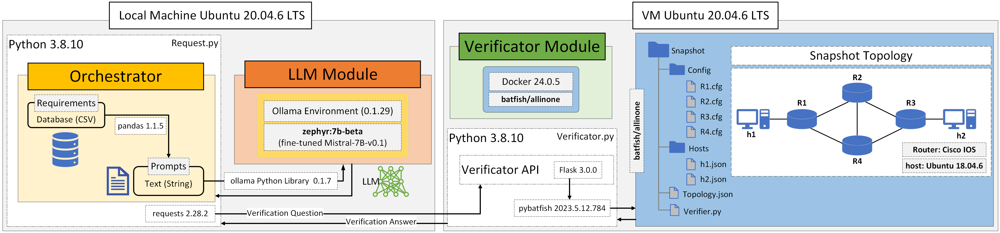
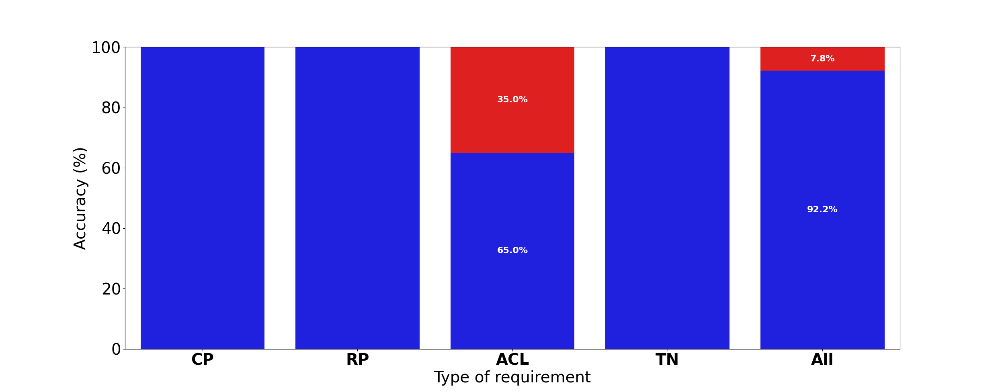
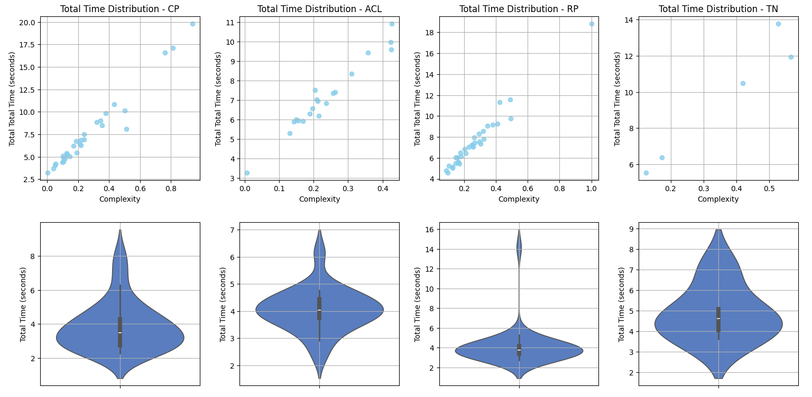

# LLM-Network Device Configurator
Framework for LLM-based automated network management configuration agent.

## Project Pre-requisites 
### LLM 
* [Ollama](https://ollama.com/download)
* [HuggingFaceH4/zephyr-7b-beta](https://huggingface.co/HuggingFaceH4/zephyr-7b-beta)

### Verificator
* [Batfish](https://github.com/batfish/batfish)
* [Pybatfish](https://pypi.org/project/pybatfish/)
* [Flask](https://pypi.org/project/Flask/)

### Orchestrator
* [Requests](https://pypi.org/project/requests/)
* [Ollama Python Library](https://pypi.org/project/ollama/)

## Files
### LLM Model

The file **zephyr_configurator** have the setup to download the zephyr-7b-beta model with the proper configurations used in the experiment. Run `ollama create modelfile` on the directory where modelfile is contained (model size 4.1GB)

### Orchestrator Script

The **Request.py** script uses ollama library to access the LLM model and request library to access the Verificator Module.
`batfish_ip need to be specified (batfish docker ip address)`

### Batfish Application 

This directory contains the files required in batfish to load the snapshot (topology). The **snapshot/** directory contains a **topology.json** file describing how each device is connected with the others, the **Verifier.py** script, a subdirectory **Configs/** with the routers configuration files and a subdirectory **Hosts/** with the hosts files.

#### Verificator Script 

The **Verifier.py** script is run in the batfish docker container and uses pybatfish library to initialize and manage the snapshot (topology).
`batfish_ip need to be specified (batfish docker ip address)`

### Prompts

The **translator.txt** and **configurator.txt** contains each role for the LLM.

## Results

The **Graphs** directory contain the **llmdata.csv** file which contain the results of the LLM model for each requirement, some manual tagging was used to facilitate the graphic design. Script **TypesPercentages.py** is used to graph <Req_Type.png> and **complexityVStimes.py** is used to graph <Total_Times.png>.

